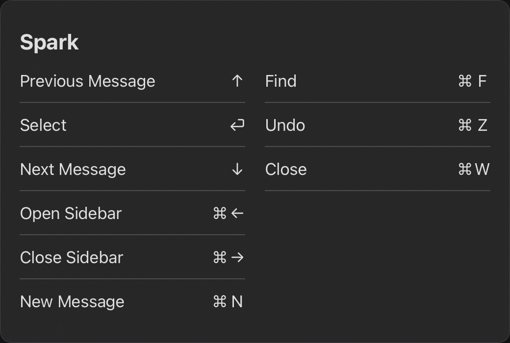

# Twitter: Regarding Spark's Keyboard Support Struggles in iOS 16
---
author: "ⓓⓐⓥⓘⓓ ⓑⓛⓤⓔ"
handle: "@NeoYokel"
source: "https://twitter.com/NeoYokel/status/1547807209823735809"
date: "07Th2022-235610"
fetched: "07We2022-054145"
likes: 0
retweets: 0
replies: 1
---

ⓓⓐⓥⓘⓓ ⓑⓛⓤⓔ ([@NeoYokel](https://twitter.com/NeoYokel)) - 07Th2022-235610

so... do [@SparkMailApp](https://twitter.com/SparkMailApp)'s Inbox navigation keyboard shortcuts just... not work? on iPadOS?

(I'm feel really bad if you guys actually answer me before another user given...)

...because they work fine on iOS with an external keyboard but ... well shucks. I didn't expect this lol. [pic.twitter.com/kWTfLHt2GL](https://twitter.com/NeoYokel/status/1547807209823735809/photo/1)

[Tweet link](https://twitter.com/NeoYokel/status/1547807209823735809)

---

SparkMail ([@SparkMailApp](https://twitter.com/SparkMailApp)) - 07Tu2022-142327

[@NeoYokel](https://twitter.com/NeoYokel) Hi! Our development team is aware of this issue and working on a fix as we speak. Sorry for the temporary inconvenience 🙌

[Tweet link](https://twitter.com/SparkMailApp/status/1549475021768335360)

---

